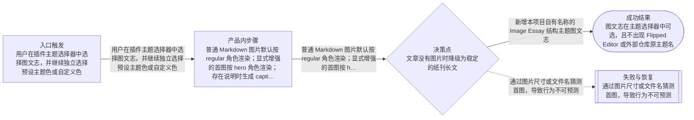

# 流程

## 主流程

- 用户在插件主题选择器中选择图文志，并继续独立选择预设主题色或自定义色
- 普通 Markdown 图片默认按 regular 角色渲染；显式增强的首图按 hero 角色渲染；存在说明时生成 caption
- 文章经过原生渲染链得到内联样式 HTML，并用于实时预览、复制和微信草稿同步

## Mermaid 流程图

## 边界情况

- 文章没有图片时降级为稳定的纸刊长文
- 图片没有说明时不输出空 caption 结构
- 自定义色过亮或过浅时，文字强调角色使用安全加深或中性色回退
- 未知主题或历史设置值仍使用现有回退行为
- 复杂内容不因杂志主题被裁切、重排或转换成不兼容结构

## 失败模式

- 通过图片尺寸或文件名猜测首图，导致行为不可预测
- 写死第二强调色，导致用户更换主题色后结构失真
- 只修改本地预览而复制或同步输出不一致
- 依赖 style 标签、class CSS、伪元素、复杂 Grid 或微信会剥离的能力
- 把大量新逻辑堆进单个主题文件或既有超大文件，超过 OpenPrd 控制线
