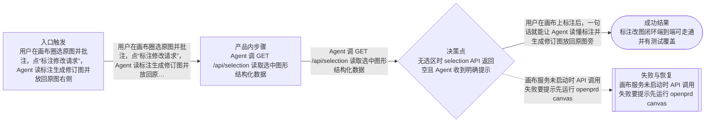
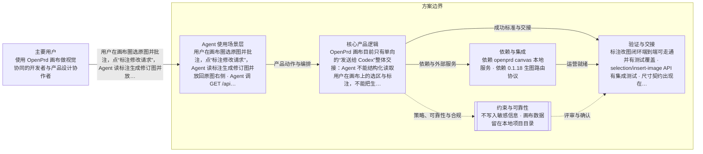

# 画布协同闭环：标注改图、双向结构化工具、尺寸契约与唤起机制
> 语言规则：用户可见说明、PRD、spec 和 tasks 跟随用户当前主语言；无法判断时才使用简体中文兜底。PRD、OpenPrd、OpenSpec、API、SDK、CLI、TypeScript、JSON、HTTP、WebSocket、字段 key、命令名、品牌名、产品名和协议名等必要专有名词保留原文。
- 版本: v0014
- 负责人: OpenPrd
- 产品场景: 以 Agent 为主要使用场景
- 场景模板: 以 Agent 为主要使用场景
- 状态: synthesized
- 生成时间: 2026-07-06 22:49:20
## 元信息

- 标题: 画布协同闭环：标注改图、双向结构化工具、尺寸契约与唤起机制
- 负责人: OpenPrd
- 状态: synthesized
- 版本: v0014
- 产品场景: 以 Agent 为主要使用场景
- 日期: 2026-07-06

## 问题

- 问题陈述: OpenPrd 画布目前只有单向的“发送给 Codex”整体交接：Agent 不能结构化读取用户在画布上的选区与标注，不能把生成图片精准放回画布锚点旁，标注修改意图靠用户口述或手动截图传递，协同链路断在“人标注完之后”这一步。
- 为什么是现在: 对标 Cowart 已验证“标注改图闭环 + 画布双向结构化工具 + 生图尺寸契约 + 具名 skill 唤起”四件能力能显著降低人机视觉协同成本；OpenPrd 0.1.18 刚落地生图路由，正好把尺寸契约与路由串起来。
- 证据:
  - Cowart 的 get_cowart_selection / insert_cowart_image / annotation-edit 元数据闭环已被 DeepWiki 调研确认
  - OpenPrd 画布现状只有 placeholderId 回填和整体 handoff，无结构化选区读取
  - 用户已确认按对标建议落地四项能力

## 用户与相关方

- 主要用户:
  - 使用 OpenPrd 画布做视觉协同的开发者与产品设计协作者
- 次要用户:
  - 待补充
- 相关方:
  - OpenPrd 维护者
  - Codex/Cursor 上的 Vibe Coding 用户

## 目标与成功标准

- 目标:
  - 用户在画布上标注后，一句话就能让 Agent 读懂标注并生成修订图放回原图旁
  - Agent 能结构化读取画布选区并把图片锚定回填
  - 生图请求自动携带占位卡尺寸契约
  - 用户能用自然语言稳定唤起画布协同
- 成功指标:
  - 标注改图闭环端到端可走通并有测试覆盖
  - selection/insert-image API 有集成测试
  - 尺寸契约出现在生图指引与占位卡 handoff 记录中
- 验收目标:
  - canvas 服务新增 GET /api/selection 与 POST /api/insert-image 且测试通过
  - 标注导出带 annotationEdit 元数据并能被 hook 指引消费
  - hook 对画布协同意图注入引导语

## 验证与创业闭环

- 可触达社区:
  - 待补充
- 第一批种子用户:
  - 待补充
- 社区契合与触达依据:
  - 待补充
- 当前替代方案: 待补充
- 痛点与替代证据:
  - 待补充
- 手工交付路径:
  - 待补充
- 手工作战卡:
  - 待补充
- 承诺信号:
  - 待补充
- 首个低成本验证: 生成 change 与任务拆解后按序实现
- 先活下来方案:
  - 待补充
- 付费验证信号:
  - 待补充
- 第一版只做一件事: 待补充
- 周末级验证: 待补充
- 最小工具桥接:
  - 待补充
- 产品化门槛:
  - 待补充
- 第一批客户路径:
  - 待补充
- 初始收费假设: 待补充
- 客户 1 盈利路径: 待补充
- 销售与增长纪律:
  - 待补充
- 可逆性判断: 待补充
- 客户真问题校验: 待补充
- 价值观一致性: 待补充

## 范围与非目标

- 范围内:
  - canvas-workspace.js 新增选区状态持久化与查询 API
  - canvas-workspace.js 新增锚定插图 API（anchorShapeId/placement/replaceHolder）
  - canvas-app.html.js 标注修改请求导出（带元数据）与选区上报
  - 生图占位卡尺寸契约写入 handoff 与生图指引
  - codex-hook-runner-template.mjs 画布协同意图识别与引导注入
  - agent-canonical-content.js 画布协同指引
  - docs/basic 与 README 同步
- 范围外:
  - 不迁移 tldraw、不做 Codex widget 内嵌
  - 不新建独立 MCP stdio server，复用画布本地 HTTP 服务
  - 不改变现有发送给 Codex 的 app-server 桥接协议

## 场景与流程

- 主流程:
  - 用户在画布圈选原图并批注，点“标注修改请求”，Agent 读标注生成修订图并放回原图右侧
  - Agent 调 GET /api/selection 读取选中图形结构化数据
  - Agent 调 POST /api/insert-image 把生成图锚定到指定图形旁
  - 用户说“打开画布一起改图”即唤起画布协同
- 边界情况:
  - 无选区时 selection API 返回空且 Agent 收到明确提示
  - 锚点图形不存在时 insert-image 报错不写脏数据
  - 占位卡无宽高时尺寸契约退化为默认比例
- 失败模式:
  - 画布服务未启动时 API 调用失败要提示先运行 openprd canvas
  - 回填图片文件缺失时保持画布 scene 不变

## 可视化图表

### 产品流程

### 架构

## 需求

- 功能需求:
  - 选区状态随画布保存并可查询
  - 插图 API 支持 left/right/below 摆放与 holder 替换
  - 标注导出携带 annotationEdit 与源图形 ID 元数据
  - 生图占位卡 handoff 记录携带宽高与比例契约
  - hook 识别画布协同意图并注入闭环指引
- 非功能需求:
  - 界面文案面向普通用户
  - API 只监听本地回环地址
  - 新增代码有集成测试覆盖
- 业务规则:
  - 只做已确认四项能力，不扩 UI 引擎替换
  - 生图仍走 0.1.18 生图路由，不擅用付费 API

## 业务护栏

- 成本来源:
  - 主要成本是生图调用次数与画布服务本地资源
- 额度与限制:
  - 首版按单画布会话协同，不开放批量自动改图
- 滥用防护:
  - insert-image 校验锚点与文件存在性，避免脏写
  - API 仅本地回环访问
- 监控信号:
  - ops.json handoff 记录数、回填成功率、API 错误率
- 报警阈值:
  - 回填连续失败时提示用户检查画布服务状态
- 止损动作:
  - 异常时停止自动回填，保留原画布快照并回退到手动流程

## 约束、依赖与风险

- 技术约束:
  - 沿用 Excalidraw embed 与现有 canvas-sessions 文件存储
  - Node 内置测试框架
  - 不新增外部依赖
- 合规要求:
  - 不写入敏感信息
  - 画布数据留在本地项目目录
- 依赖:
  - 依赖 openprd canvas 本地服务
  - 依赖 0.1.18 生图路由协议
- 假设:
  - 用户接受标注截图作为修改指令载体
  - Excalidraw selection 数据足以表达锚定需求
- 风险:
  - Excalidraw 与 tldraw 数据模型差异导致锚定语义需要适配
  - 标注文字识别依赖 Agent 视觉能力
- 开放问题:
  - 后续是否把画布协同扩展为独立 MCP server 另行评估

## 类型专项模块

- 类型: Agent 使用场景专项
- humanAgentContract: 标注意图由人给出，修订图生成与回填由 Agent 自动完成；替换原图等破坏性动作仍需人确认。
- autonomyBoundary: Agent 可自动读选区、生成并旁位回填；不得覆盖或删除用户原图与标注。
- toolBoundary: 使用画布本地 HTTP API、生图路由选定的内置生图工具与 OpenPrd CLI。
- stateModel: 画布 scene/selection/ops 文件保存在 .openprd/harness/canvas-sessions/<session-key>/。
- evalPlan: 集成测试覆盖 selection/insert-image/标注导出元数据/hook 引导注入，最终跑 dev-check 与发布前四项验证。

## 交接

- 负责人: OpenPrd
- 下一步: 生成 change 与任务拆解后按序实现
- 目标系统: OpenPrd CLI 画布子系统
