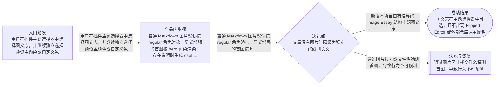
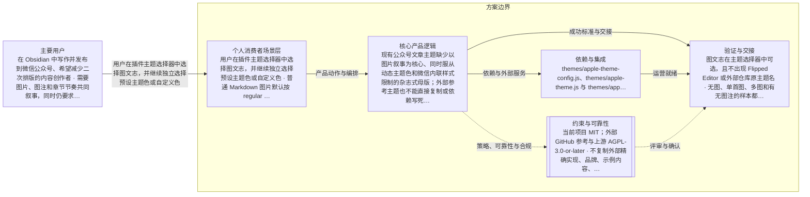

# 图文志公众号主题第一阶段
> 语言规则：用户可见说明、PRD、spec 和 tasks 跟随用户当前主语言；无法判断时才使用简体中文兜底。PRD、OpenPrd、OpenSpec、API、SDK、CLI、TypeScript、JSON、HTTP、WebSocket、字段 key、命令名、品牌名、产品名和协议名等必要专有名词保留原文。
- 版本: v0002
- 负责人: 项目维护者
- 产品场景: 面向个人消费者场景
- 场景模板: 面向个人消费者场景
- 状态: synthesized
- 生成时间: 2026-08-01 08:20:36
## 元信息

- 标题: 图文志公众号主题第一阶段
- 负责人: 项目维护者
- 状态: classified
- 版本: v0002
- 产品场景: 面向个人消费者场景
- 日期: 2026-08-01

## 问题

- 问题陈述: 现有公众号文章主题缺少以图片叙事为核心、同时服从动态主题色和微信内联样式限制的杂志式母版；外部参考主题也不能直接复制或依赖写死色板，需要结合本项目主题系统进行原创重设计。
- 为什么是现在: 用户已经完成 Flipped Editor 与公开 GitHub 主题的调研取舍，并选择 Image Essay 作为第一批母版，希望按规划开始实施。
- 证据:
  - Flipped Editor 公开页面展示了 Image Essay 的图文叙事结构
  - 本项目 AppleTheme 已支持 8 个预设主题色和任意 customColor，并统一服务预览、复制与草稿同步
  - 外部 GitHub 仓库与上游为 AGPL-3.0-or-later，而本项目为 MIT，因此默认采用 clean-room 原创重设计

## 用户与相关方

- 主要用户:
  - 在 Obsidian 中写作并发布到微信公众号、希望减少二次排版的内容创作者
  - 需要图片、图注和章节节奏共同叙事，同时仍要求代码、公式、表格与 Callout 兼容的作者
- 次要用户:
  - 待补充
- 相关方:
  - 项目维护者
  - 依赖实时预览、复制与草稿同步一致性的现有用户

## 目标与成功标准

- 目标:
  - 新增本项目自有名称的 Image Essay 结构主题图文志
  - 在有图和无图文章中都形成稳定、可预测的长文排版
  - 让新结构完整服从动态主题色与自定义色，而不是依赖外部固定色板
  - 保持预览、复制和微信草稿同步的基础 HTML 一致
- 成功指标:
  - 图文志在主题选择器中可选，且不出现 Flipped Editor 或外部仓库原主题名
  - 无图、单首图、多图和有无图注的样本都不破版
  - 8 个预设主题色与亮色、暗色、低饱和自定义色下均保持结构和文字可读性
  - 项目 guard、目标测试、生成物检查和构建通过，真实公众号验证项有明确证据或明确保留为人工联调
- 验收目标:
  - 第一阶段只实现 hero、regular、caption、无图降级、动态主题色和微信内联兼容
  - 图片角色行为可预测，不按尺寸、文件名或主观算法猜测
  - 复杂表格、代码、数学、Mermaid 与 Callout 以兼容优先，不强行杂志化
  - 本轮新增或实质扩展的源码模块保持在 OpenPrd 正常控制线 700 行以内；达到预警即按职责拆分
  - 不把新职责继续堆进 input.js、converter.js、views/converter/core.js 或其他已有大文件

## 验证与创业闭环

- 可触达社区:
  - 待补充
- 第一批种子用户:
  - 待补充
- 社区契合与触达依据:
  - 待补充
- 当前替代方案: 待补充
- 痛点与替代证据:
  - 待补充
- 手工交付路径:
  - 待补充
- 手工作战卡:
  - 待补充
- 承诺信号:
  - 待补充
- 首个低成本验证: 生成并确认 stable review 后，建立 change/tasks，只实施图文志第一阶段并按任务证据验证。
- 先活下来方案:
  - 待补充
- 付费验证信号:
  - 待补充
- 第一版只做一件事: 待补充
- 周末级验证: 待补充
- 最小工具桥接:
  - 待补充
- 产品化门槛:
  - 待补充
- 第一批客户路径:
  - 待补充
- 初始收费假设: 待补充
- 客户 1 盈利路径: 待补充
- 销售与增长纪律:
  - 待补充
- 可逆性判断: 待补充
- 客户真问题校验: 待补充
- 价值观一致性: 待补充

## 范围与非目标

- 范围内:
  - 图文志主题注册与本项目自有命名
  - hero、regular、caption 与无图降级的图片叙事结构
  - accent、accent-readable、accent-deep、accent-soft 与中性色角色合同
  - 必要的图片角色解析与原生序列化接入
  - 主题、颜色、图片角色、序列化和微信兼容的自动化与视觉证据
  - 按职责拆分源码并遵守 OpenPrd 行数与文件说明书门禁
- 范围外:
  - 本轮不实现 wide 跨栏图片角色
  - 本轮不实现章序、框签、边页或疏文
  - 不把 GitHub 主题融入图文志，也不保留其固定绿黄、红白、橄榄橙色板
  - 不复制 Flipped Editor 或 AGPL 仓库的源码、精确 CSS、装饰 HTML、品牌、示例文案、图片或素材
  - 不修改文章模式以外的平台业务边界，不进行生产部署、发布、commit、push 或 PR

## 场景与流程

- 主流程:
  - 用户在插件主题选择器中选择图文志，并继续独立选择预设主题色或自定义色
  - 普通 Markdown 图片默认按 regular 角色渲染；显式增强的首图按 hero 角色渲染；存在说明时生成 caption
  - 文章经过原生渲染链得到内联样式 HTML，并用于实时预览、复制和微信草稿同步
- 边界情况:
  - 文章没有图片时降级为稳定的纸刊长文
  - 图片没有说明时不输出空 caption 结构
  - 自定义色过亮或过浅时，文字强调角色使用安全加深或中性色回退
  - 未知主题或历史设置值仍使用现有回退行为
  - 复杂内容不因杂志主题被裁切、重排或转换成不兼容结构
- 失败模式:
  - 通过图片尺寸或文件名猜测首图，导致行为不可预测
  - 写死第二强调色，导致用户更换主题色后结构失真
  - 只修改本地预览而复制或同步输出不一致
  - 依赖 style 标签、class CSS、伪元素、复杂 Grid 或微信会剥离的能力
  - 把大量新逻辑堆进单个主题文件或既有超大文件，超过 OpenPrd 控制线

## 可视化图表

### 产品流程

### 架构

## 需求

- 功能需求:
  - AppleTheme 主题列表新增图文志，主题和颜色仍是两个独立选择维度
  - 提供可复用的动态颜色角色与对比度保护，不为图文志写颜色特例
  - 提供明确且可测试的 hero、regular、caption 语义合同
  - 为标题、正文、引用、列表、表格、图片、图注、链接和代码生成自洽的内联样式
  - 自定义 CSS 继续作为现有后置覆盖层
- 非功能需求:
  - 通过 npm run scan:guard 以及风险相称的 review:guard、build 和生成物检查
  - 本轮新增或实质扩展源码文件以 700 行为拆分线，不以 1500 行警戒线上限作为目标
  - 新逻辑按颜色工具、主题配置、图片语义、序列化接入和测试职责拆分
  - 不手改 main.js 或 services/generated-embedded-deps.js，使用项目脚本生成
  - 公众号兼容与可访问性优先于本地预览中的复杂视觉效果
- 业务规则:
  - Image Essay 线与 GitHub 外部主题线严格分开
  - 所有用户可见名称与代码标识使用本项目自有命名
  - 外部固定配色不是可迁移资产；新结构只能使用用户当前动态主题色的安全派生与中性色
  - 第一批只落地图文志；其他候选需独立视觉评审后另行进入实现
  - 默认使用 clean-room 原创重设计，除非未来取得单独授权或另行接受许可证影响

## 业务护栏

- 成本来源:
  - 待补充
- 额度与限制:
  - 待补充
- 滥用防护:
  - 待补充
- 监控信号:
  - 待补充
- 报警阈值:
  - 待补充
- 止损动作:
  - 待补充

## 约束、依赖与风险

- 技术约束:
  - 运行环境是 Obsidian Electron/CommonJS，主题源码会进入 generated-embedded-deps
  - 微信输出必须以标签级内联样式和必要结构节点为主
  - 沿用 AppleTheme、原生 renderer/serializer 与现有 settings/core 实时刷新链路，不建立平行主题引擎
  - input.js 保持轻量，样式、图片语义与序列化职责分别落在对应模块
  - OpenPrd codeFileLines 正常上限为 700 行；触达已有超线文件时只做最小接线并把新职责拆出
- 合规要求:
  - 当前项目 MIT；外部 GitHub 参考与上游 AGPL-3.0-or-later
  - 不复制外部精确实现、品牌、示例内容、图片或素材
  - 不记录凭据、用户内容或生产账号信息
- 依赖:
  - themes/apple-theme-config.js、themes/apple-theme.js 与 themes/apple-theme-headings.js
  - services/obsidian-triplet-serializer.js 与现有 render pipeline
  - views/converter/settings-panel.js 与 views/converter/core.js
  - npm run generate:embedded、Vitest、scan/review guard、build 与 build-artifact checks
- 假设:
  - 用户选择 Image Essay 是对结构方向的确认，不代表接受 Flipped Editor 的品牌、颜色或源码实现
  - 图文志第一阶段可以在不实现 wide 的情况下独立成立
  - hero 使用显式增强且未标记时安全降级，具体语法需在 stable review 中明确
- 风险:
  - 杂志式结构提高内容图片质量与图注一致性的要求，需要清晰降级而不是强制作者重写文章
  - 极亮自定义色可能降低白底文字对比度，需要共用颜色工具保护
  - 本地预览与微信编辑器处理差异可能造成视觉漂移，需要复制和草稿侧证据
  - 现有主题和渲染文件部分已接近或超过行数控制线，若不提前拆分会增加维护成本
- 开放问题:
  - 图文志 hero 的显式 Markdown 标记语法在 stable review 中冻结；默认不得使用尺寸或文件名推断
  - 真实公众号账号联调若本轮环境不可用，必须作为未完成验证明确保留，不得以本地截图替代

## 类型专项模块

- 类型: 个人消费者场景专项
- persona: 希望在 Obsidian 写完后，以较少二次排版成本获得具有图片叙事感、又能稳定进入微信公众号的中文内容创作者。
- segment: 重视排版审美、图片与文字节奏，同时要求 Markdown 复杂内容兼容的个人创作者与技术写作者。
- journey:
  - 在当前笔记中准备图片与可选图注
  - 在主题选择器中选择图文志并选择任意主题色
  - 通过实时预览检查有图或无图的叙事节奏
  - 复制富 HTML 或同步到微信草稿并完成最终平台检查
- activationMetric: 用户首次选择图文志后，在不修改原文结构的前提下获得可读预览，并成功完成一次复制或草稿同步。
- retentionMetric: 用户在后续图文文章中继续复用图文志，并减少微信编辑器中的重复排版调整。

## 交接

- 负责人: 项目维护者
- 下一步: 生成并确认 stable review 后，建立 change/tasks，只实施图文志第一阶段并按任务证据验证。
- 目标系统: obsidian-wechat-converter 的 AppleTheme 与原生公众号渲染链
