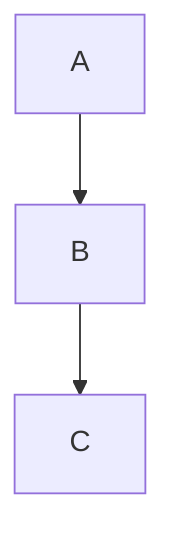

# 过滤内容样本

## 代码块

```js
function filtered() {
  return "此代码块应被省略";
}
```

## Mermaid 图



## GIF


## 块级公式

$$
E = mc^2
$$

## 行内公式段落（高风险诊断）

这段文字中间包含一个行内公式 $a^2 + b^2 = c^2$，按一期规则应整段省略并标记为高风险诊断，而不是抹掉公式拼接两侧文字。

- 列表项一（正常，应保留）
- 列表项二包含行内公式 $\int_0^1 x dx$，整项省略并高风险标记
- 列表项三（正常，应保留）

## 代码块紧跟代码块（计数验证）

```python
print("first")
```

```python
print("second")
```

## 结尾正常段

这一段在所有过滤内容之后，应正常保留，验证省略不影响后续块。
